# Content Editing

**This page is intended for content editors. For information for software developers, [click here](../developers).**

* [Getting Started](#getting-started)
* [Edit a Page](#edit-a-page)
* [Create a Page](#create-a-page)
  * [Downloads](#downloads)
  * [Videos](#videos)
  * [Effects](#effects)
* [Delete Pages](#delete-a-page)
* [Edit the Homepage](#edit-homepage)
* [Search](#search)
* [Edit Menus](#edit-menus)

## Getting Started

Before you get started, you will need a GitHub account with access to the `boris-fx` organization, and have your email address added to the Forestry project `borisfx`.

Make sure you have access to the GitHub repository by going https://github.com/boris-fx/web.

Join the Slack channel `#website`. This channel will receive notifications from GitHub every time there is a change to the site, and it will receive notifications from [Netlify](https://netlify.com/), the Content Delivery Network that hosts the site, whenever a new deployment begins, succeeds, or fails. You can use this channel to track your teammates changes to the site, and make sure your changes deploy successfully.

Go to https://forestry.io/login and click the GitHub icon to log in with GitHub.

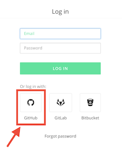

After logging in, press the green "Authorize Application" button. You will be taken to the "My Sites" page, where the `borisfx` site should be listed. If it is not, you have not been added to the `borisfx` Forestry project.

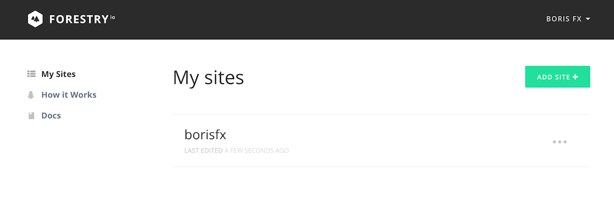

Select the `borisfx` site to open the dashboard. To the left you will see the left sidebar which lists what are called "sections" of the site, for example "Downloads" and "Videos". To the right you will see a list of the files in the currently selected section.

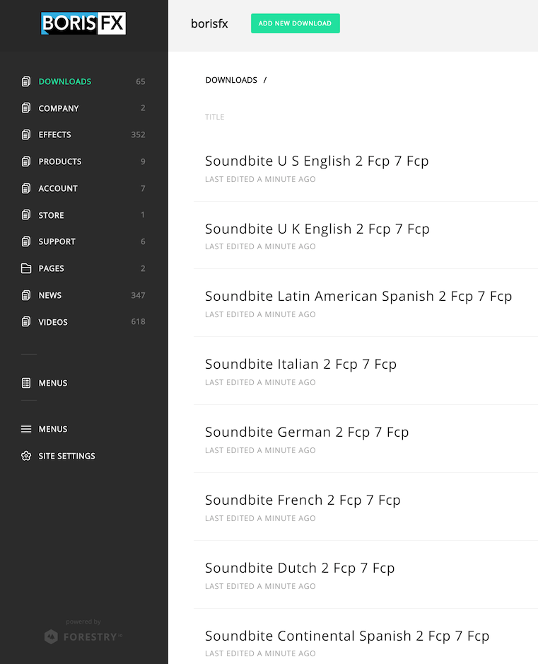

## Edit a Page

Choose "Videos" in the left sidebar and select any video to edit it. Here you can make changes to the title, date, tagging, thumbnail URL, video URL, and body.

When modifying the body, you will be able to edit the text in WYSIWYG (What You See Is What You Get) mode and either HTML or Markdown mode depending on whether the file is originally written in HTML or Markdown. For most use cases the WYSIWYG editor will suffice, but you can switch to HTML or Markdown mode as necessary. The toggle to switch is at the upper right of the editor.

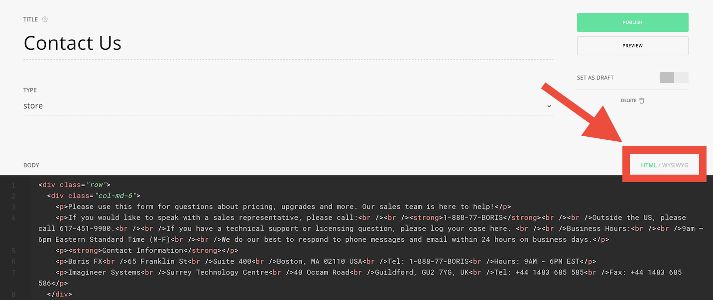

Modify the body with a test change, then click the "Preview" button below the "Publish" button in the top right.

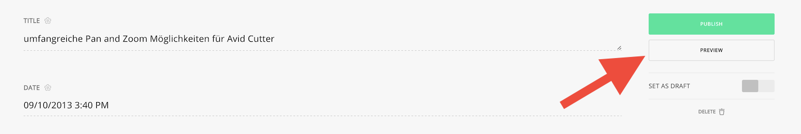

This will open a new browser tab which, after a brief loading spinner, will show a preview of the modified page. This preview is part of a preview of the full modified site, so you can navigate anywhere on the site and see how it will appear following your change. This is useful, for example, if you change the tagging of a video and want to see how it will be reflected on the gallery page located at https://borisfx.com/videos/.

When you are satisfied with the changes, you can publish them by clicking the green "Publish" button above "Preview". If you go to Slack you will see a message with your change, then a message indicating Netlify has begun deploying the change, and finally, after around a minute, a message saying the change was successfully deployed.

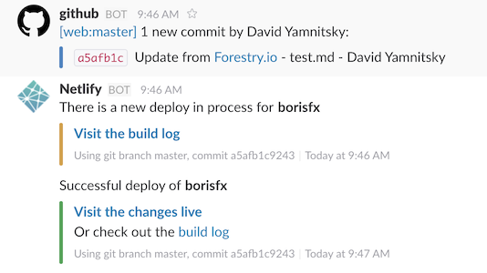

You can now view your change on the live site at https://borisfx.com/. Please note that all the changes described below will be subject to the same process before being live on the site.

## Delete a Page

To delete a page, you can click the "Delete" button below the "Publish" and "Preview" buttons when editing a page.

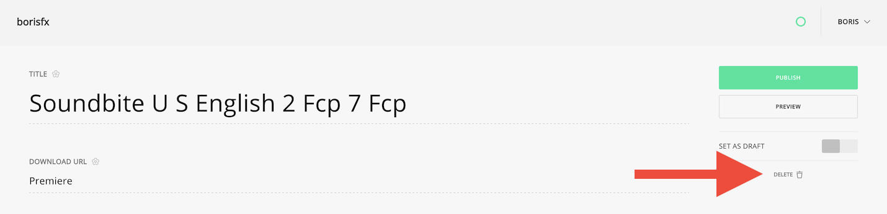

## Create a Page

To create a page, click the section you wish to add to in the left sidebar, for example "Videos". At the top click the "Add New Video" button.

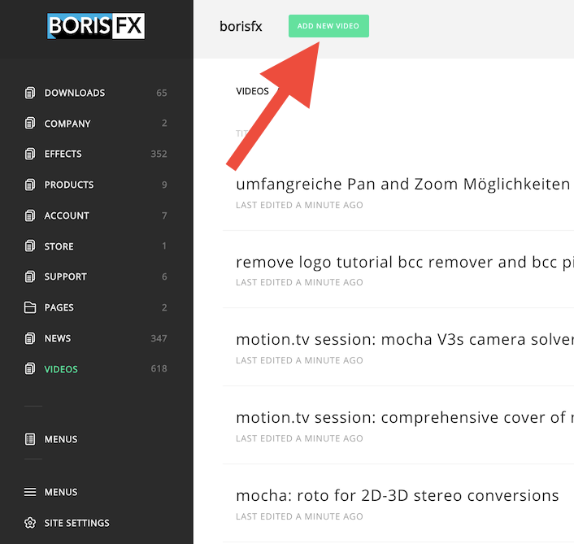

Choose a title for your new video and click "Create".

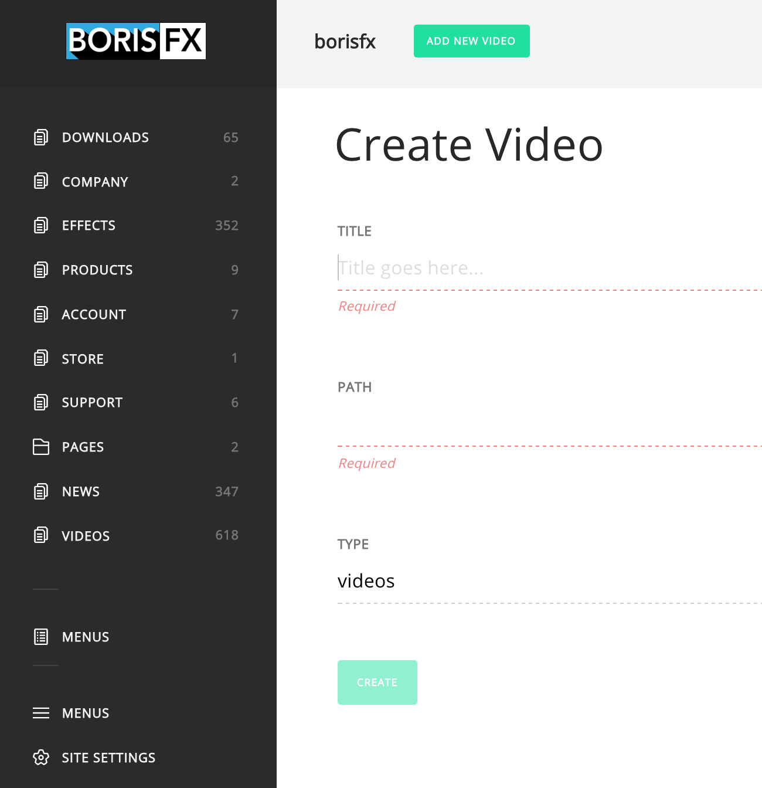

Now you can edit the fields of the video you created. Try editing the tagging, title, video URL, and thumbnail URL.

When you are done, click the "Preview" button in the top right to preview your change, and if it looks good, click the "Publish" button.

The fields that each piece of content should have will always be presented automatically. You should not create new fields or remove any of the fields given unless you are sure you know what you are doing.

## Edit the Homepage

The content for the homepage that can be edited in Forestry can be found in the "Pages" section as the file "_index.html". Some of the Homepage content is in the template, which must be edited on GitHub in the file `/layouts/index.html`.

## Search

When viewing the root of a section, you can search for files by name by clicking the magnifying glass near the top right.

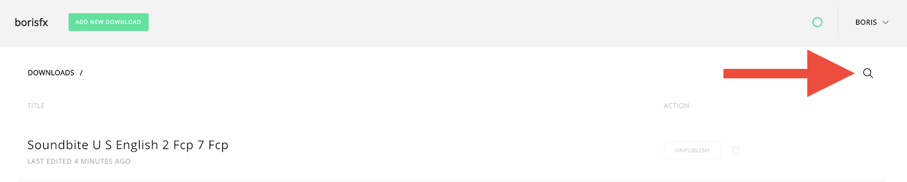

For full-text search, I recommend you use GitHub. Go to the project at https://github.com/boris-fx/web and enter the text you want to search for at the top of the screen.

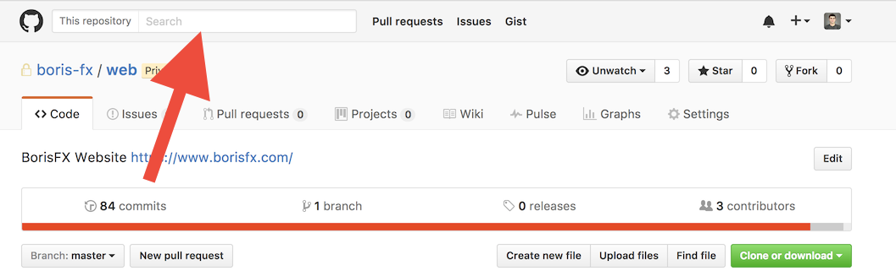

On the following page you will see the results, with the relevant content highlighted and the name of the file above, as shown below:

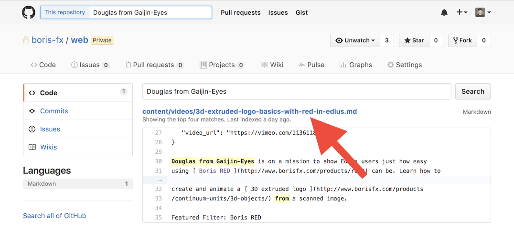

You can now go back to Forestry and navigate to the relevant file, possibly using Forestry's file search as described above to locate the file in the particular section if the list is long.

## Edit Menus

To edit the header and footer navigation menus in Forestry, click the "Menus" item in the left sidebar that is closer to the top. There will be two there, but the lower one we aren't using.

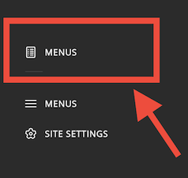

On the next screen you will see the menus and the items within them. You can drag and drop to reorder the items.

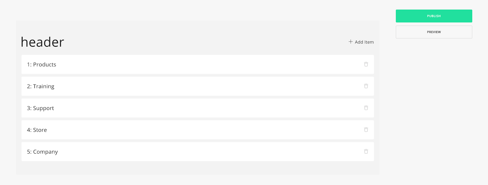

Clicking one of the items will take you into the edit screen for that item.

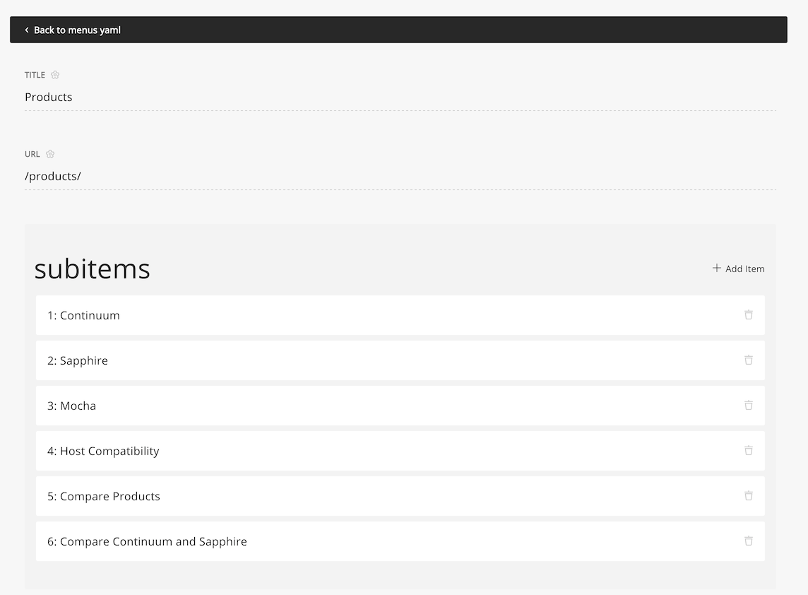

Make a change either at the top level or in one of the sublevels, then navigate back to the top level by clicking the link beginning with "Back to" until you get to the top level. Then you can click "Preview" to preview the changes and "Publish" to publish them.
